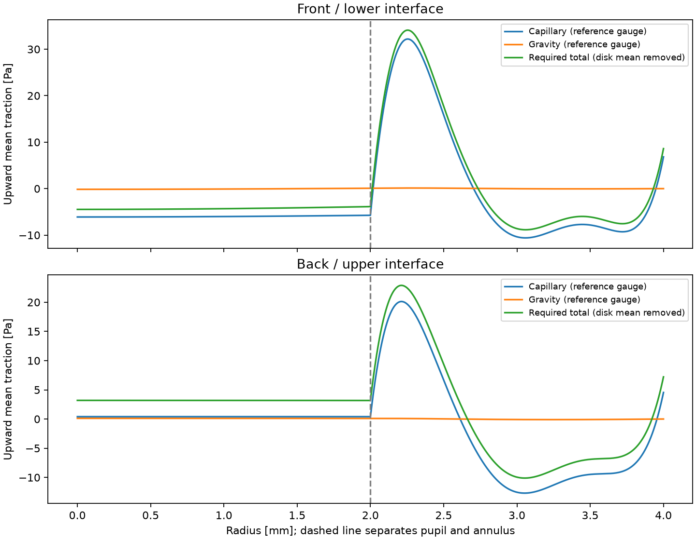
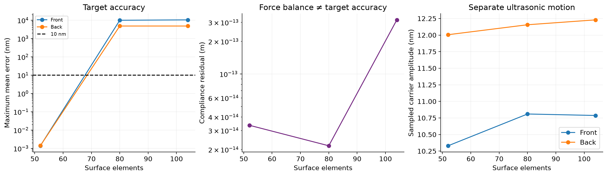

# Acoustic Freeform Lab

Private research on shaping fluid interfaces inside a cylinder with admissible
acoustic sources. The primary question is which full-interface mean loads a
bounded continuous source space can produce, and whether the resulting driven
state is reachable and stable. Finite arrays are restricted source spaces.
Cartesian optical surfaces are a later worked target.

## Current evidence

| Gate | Reviewed state |
|---|---|
| General theory | [Canonical LaTeX and bibliography](docs/theory/README.md); [active PDF](acoustic-fluid-shaping-theory.pdf) |
| Optical target and required load | Positive numerical ideal-load result in a declared three-fluid model; no acoustic source implied |
| Finite emitter synthesis | A coupled design-grid root exists, but the optical gates fail and fixed-command refinement is unfinished |
| Emitter-driven formation | The saved partial Stokes trajectory does not form the target; it does not establish physical impossibility |
| Physical apparatus | No experimental validation or complete thermal, wall-layer mean-streaming and three-dimensional stability assessment |

[Research status](STATUS.md) gives the reviewed verdict and model scope for each
study. [Studies](studies/README.md) link the protocol, reports and saved states.
The active optical height goal is 10 nm maximum cycle-mean error on each fixed
clear aperture; spot and full-ray-coverage gates are separate. A convincing
rendering or a small frozen inverse residual is not a verified physical lens.

## Research figures



*Required mean traction on both interfaces in the prescribed-load model. This
calculation establishes a mechanical target; it does not establish that an
acoustic source can produce the load. [Study S03](studies/S03-stigmatic-target-ideal-load/study.md).*



*A historical independent-patch candidate loses height accuracy when the same
physical source command is checked on a refined surface grid. Its small force
residual does not certify the optical result. [Study S02](studies/S02-independent-two-face/study.md).*

## Research path

```text
admissible optical target → required full-interface load
                         → acoustic source reachability and synthesis
                         → held-command coupled equilibrium
                         → independent fixed-command refinement
                         → driven stability, formation and later curing
```

The [research contract](docs/research-program.md) and
[architecture](docs/architecture.md) distinguish implemented models, numerical
checks and open physics. The [September numerical-stability note](docs/numerical-stability.md)
records the wall-loss finding and limitations. The [documentation index](docs/README.md)
provides detailed historical reports.

## Use the repository

```sh
uv sync --dev
uv run ruff check src tools
python3 tools/build_research_index.py --check
uv run afl --help
```

`afl` exposes the implemented target, load, finite-source synthesis, held-command
equilibrium, wave-refinement and formation steps. Each command needs a declared
JSON configuration and writes a new directory under `artifacts/`. It is not a
validated end-to-end compiler for arbitrary source distributions. The older
single-interface CLI remains `lenslab`.

| Location | Responsibility |
|---|---|
| `docs/theory/` | Canonical general theory; compiled PDFs and build manifests temporarily at the repository root |
| `src/acoustic_freeform/` | Physics and algorithms grouped by apparatus, optics, mechanics, acoustics, inverse, forward and verification |
| `studies/` | Reviewed evidence ledger and five scientific questions |
| `artifacts/studies/` | Active numerical evidence, grouped by study and excluded from Git |
| `configs/` | Immutable historical inputs and relocation map; all solver values use SI units |
| `notebooks/` | Editable presentations; executed copies live with their study artifacts |
| `references/` | Primary-source reading map and private source library |

Source and artifact milestones, plus superseded exploratory outputs, are
preserved separately in `/Users/blancus/Private/research-archives/`. The private
GitHub repository contains the source, two compiled theory PDFs, reviewed study
summaries and README figures. Detailed numerical runs and private papers remain
in the local research data tree.
